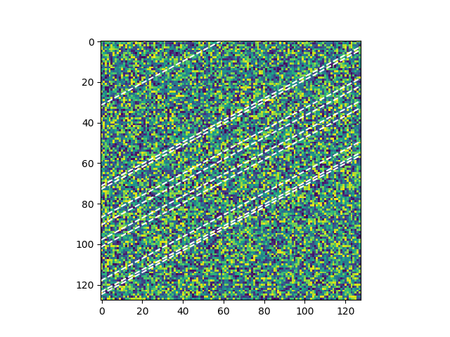

# satellize

A simple and important function that adds artificial satellite trails to a maplotlib axis, as caused by some hypothetical unnamed cluster of satellites
    
For quick tests:

```
import satellize

satellize.example(output="test.png") # quick example, dumps to file
```



For great justice:
```
satellize.satellize(ax) # ax is some matplotlib axis object
satellize.satellize(plt) # plt is the matplotlib.pyplot object
```

Note that for convenience, you can bind this command to a shorter statement. For instance,

```
starlink = satellize.satellize
starlink(ax)

oneweb = satellize.satellize
oneweb(ax)
```

etc
